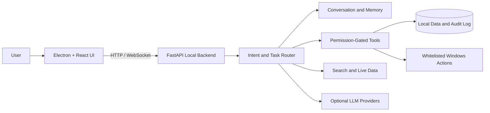

# NEXA AI

<div align="center">

### A local-first, safety-gated AI desktop assistant for Windows

[](https://github.com/abdurrahman422/nexa_ai)
[](https://github.com/abdurrahman422/nexa_ai)
[](frontend)
[](backend)

**Voice, chat, live web answers, safe desktop actions, reminders, content tools, and multi-provider AI in one extensible desktop experience.**

[Features](#-features) · [Install](#-install-and-run) · [Configuration](#-optional-configuration) · [Architecture](#-architecture) · [Safety](#-safety-by-design) · [Troubleshooting](#-troubleshooting)

</div>

---

## Overview

Nexa AI is a Windows desktop assistant built as an academic software project with a practical product direction. It combines a cinematic React and Electron interface with a local FastAPI service that handles conversation routing, live information, voice, productivity tools, and carefully restricted desktop actions.

The core application can run without a paid AI API. Optional provider keys can be added for hosted LLMs, higher-quality search, Google Cloud streaming speech-to-text, and AI image generation.

> [!IMPORTANT]
> Nexa AI is under active development. The main assistant, safety center, chat, web answers, reminders, voice integrations, YouTube controls, WhatsApp drafting, and packaging workflow are implemented. Some automation templates remain preview-only.

## ✨ Features

| Area | What Nexa AI can do | Availability |
|---|---|---|
| AI conversation | Local persona responses, Bangla/Banglish/English handling, contextual replies, pending-task memory, and smart intent routing | Built in |
| Hosted LLM routing | Optional Gemini-first routing with Groq, OpenRouter, Cloudflare, Mistral, and Cerebras fallbacks | Optional API keys |
| Live web answers | Search-backed current information using free DuckDuckGo/Wikipedia fallbacks or optional search providers | Built in; internet required |
| Voice input | Push-to-talk and voice-room flows with browser speech recognition or optional Google Cloud streaming STT | Internet required |
| Voice output | Bangla and English neural speech through Edge TTS | Internet required |
| Safe launcher | Opens recognized, whitelisted Windows apps and websites with permission and confirmation controls | Built in |
| YouTube assistant | Search/play, pause, seek, volume, captions, speed, theater/fullscreen, autoplay, and sleep timer | Chrome + internet |
| WhatsApp drafts | Local contact aliases, tone-aware draft composition, and safe `wa.me` links | Draft-only; never auto-sends |
| Smart reminders | Natural-language reminders, recurrence, editing, snooze, and local persistence | Built in |
| Document tools | Read-only PDF/TXT/Markdown preview and safe file-name search | Built in |
| Content writer | Exports confirmed Markdown/TXT content only into Nexa's generated-content directory | Permission-gated |
| AI Image Studio | Queued Hugging Face image generation with a local gallery | Optional token |
| Performance dashboard | Local audit analytics and CSV/JSON export | Built in |
| Security center | User-controlled permissions, audit history, allowlists, and permanently blocked dangerous capabilities | Built in |
| Windows distribution | Portable ZIP and optional Inno Setup installer containing the frontend and standalone backend | Build workflow ready |

## 🧭 Application Areas

- **Command Center** for chat, natural-language commands, quick launch, and assistant responses.
- **Voice Room** for Bangla/English speech input and spoken replies.
- **Web Answers** for current, source-backed information.
- **Launcher and System Controls** for approved apps, websites, media, and normal-close actions.
- **Reminder Center** for personal task and schedule management.
- **YouTube Control Panel** for browser playback control.
- **Content and Image Studios** for permission-gated creation workflows.
- **History and Analytics** for transparent local audit records.
- **Settings and Security Center** for providers, voice engines, profile data, and permissions.

## 🛠 Technology Stack

| Layer | Technologies |
|---|---|
| Desktop client | Electron 33, React 19, TypeScript, Vite 7 |
| Interface | Framer Motion, Lucide, Three.js, React Three Fiber, Globe.gl |
| Local service | Python 3.11+, FastAPI, Uvicorn, Pydantic |
| Data | Local JSON and SQLite-backed application data |
| Voice | Web Speech, Google Cloud Speech (optional), Edge TTS |
| Search and AI | Free web fallbacks, Serper and other search providers, optional hosted LLM router |
| Automation and media | Selenium-based YouTube control, restricted Windows integrations |
| Distribution | PyInstaller backend bundle, Electron runtime, ZIP, optional Inno Setup 6 |

## 🏗 Architecture



The frontend owns interaction and visualization. The backend owns routing, validation, permissions, persistence, integrations, and audit logging. Desktop actions are never executed solely because the interface requested them; the backend applies its own safety rules.

## 📥 Install and Run

There are two ways to use Nexa AI.

### Option A: Portable Windows build

When a packaged build is published under [GitHub Releases](https://github.com/abdurrahman422/nexa_ai/releases):

1. Download `NexaAI-Windows.zip`.
2. Extract the complete ZIP to a writable folder.
3. Open the extracted folder and run `NexaAI.exe`.
4. Allow network and microphone access only for the features you want to use.

The portable build contains Electron and the standalone Python backend. A destination computer does **not** need Python, Node.js, npm, pip, or a virtual environment.

> [!NOTE]
> Public builds are not code-signed yet, so Windows SmartScreen may display an unknown-publisher warning. Verify that the file came from this repository before running it.

### Option B: Run from source

This is the recommended path for development, evaluation, and project demonstration.

#### Requirements

| Requirement | Version / purpose |
|---|---|
| Windows | Windows 10 or 11, 64-bit |
| Git | Required to clone the repository |
| Python | 3.11 or newer |
| Node.js | 20 LTS or newer, including npm |
| Google Chrome | Required only for advanced YouTube control |
| Internet | Required for live search, online voice, YouTube, hosted AI, and image generation |

#### 1. Download the project

```powershell
git clone https://github.com/abdurrahman422/nexa_ai.git
cd nexa_ai
```

Alternatively, use **Code → Download ZIP** on GitHub, extract it, and open PowerShell inside the extracted folder.

#### 2. Set up the backend

```powershell
cd backend
python -m venv .venv
.\.venv\Scripts\Activate.ps1
python -m pip install --upgrade pip
python -m pip install -r requirements.txt
Copy-Item .env.example .env
python run_backend.py
```

Keep this terminal open. The backend runs at `http://127.0.0.1:8000`; health check: `http://127.0.0.1:8000/api/health`.

No API key is required for the default local/free mode. The copied `.env` file is for local settings and is excluded from Git.

#### 3. Set up the desktop app

Open a second PowerShell window in the repository root:

```powershell
cd frontend
npm.cmd install
npm.cmd run dev
```

Vite starts on `http://127.0.0.1:5173`, and the Electron desktop window opens automatically. Start the backend first so all backend-connected features are available.

## 🔌 Optional Configuration

Edit `backend/.env` only for services you plan to use. Never commit this file or any credential JSON.

### Hosted AI providers

```env
NEXA_LLM_ROUTER_ENABLED=true
NEXA_LLM_PRIMARY=gemini

GEMINI_API_KEY=
GROQ_API_KEY=
OPENROUTER_API_KEY=
CLOUDFLARE_ACCOUNT_ID=
CLOUDFLARE_API_TOKEN=
MISTRAL_API_KEY=
CEREBRAS_API_KEY=
```

At least one valid provider key is required only when hosted LLM routing is enabled. Local conversation and rule-based tools remain available without these keys.

### Enhanced web search

The default free mode needs no key:

```env
NEXA_SEARCH_PROVIDER=free
```

For Serper-powered search:

```env
NEXA_SEARCH_PROVIDER=serper
SERPER_API_KEY=your_key_here
```

SearXNG, Brave Search, Google Custom Search, and SerpAPI settings are also supported. See [`backend/.env.example`](backend/.env.example) for every available variable.

### AI image generation

```env
HUGGINGFACE_API_KEY=your_token_here
HUGGINGFACE_IMAGE_MODEL=black-forest-labs/FLUX.1-schnell
```

After configuring a token, enable **AI Image Generation** in Nexa's Security Center.

### Google Cloud streaming speech-to-text

1. Create a Google Cloud project and enable Speech-to-Text.
2. Create a service account with the required speech permission.
3. Store its JSON credential **outside** this repository.
4. Add its absolute path to `backend/.env`:

```env
NEXA_GOOGLE_STT_ENABLED=true
GOOGLE_APPLICATION_CREDENTIALS=C:\private\path\google-stt.json
```

Nexa falls back to browser speech recognition when Google streaming STT is unavailable.

### What is actually required?

| Capability | Additional setup |
|---|---|
| Core UI, local assistant, reminders, safety center | Nothing beyond standard installation |
| Free web answers | Internet connection |
| Edge neural TTS / browser STT | Internet and microphone permission |
| Advanced YouTube control | Google Chrome and internet |
| Hosted AI responses | One supported LLM provider key |
| Higher-quality Serper search | Serper API key |
| AI image generation | Hugging Face token + permission toggle |
| Google streaming STT | Google Cloud credentials + permission toggle |
| Build an installer | Inno Setup 6 |

## 🛡 Safety by Design

Nexa AI treats desktop control as a permissioned capability, not an unrestricted agent action.

- App and website launch targets are allowlisted.
- Sensitive actions require confirmation unless a narrowly scoped trusted mode is enabled.
- File search and document preview are read-only.
- WhatsApp integration creates drafts and never clicks **Send**.
- Generated content is written only to Nexa-managed output folders.
- Permissions are visible and adjustable in the Security Center.
- Executed and blocked actions are recorded in a local audit trail.
- Shell execution, arbitrary app execution, file delete/move/rename/edit, and automatic message sending are permanently locked off.

## 📦 Build a Windows Release

Install the development requirements first, then run:

```powershell
cd frontend
npm.cmd install
npm.cmd run package:windows
```

The workflow builds the React frontend, creates a standalone PyInstaller backend, bundles Electron, and produces `release/NexaAI-Windows.zip`.

To also create `NexaAI-Setup.exe`, install [Inno Setup 6](https://jrsoftware.org/isinfo.php) and run:

```powershell
powershell -ExecutionPolicy Bypass -File scripts/package-windows.ps1 -BuildInstaller
```

Before public distribution, code-sign the executables and installer. Do not package local `.env` files, API keys, virtual environments, downloaded models, databases, or user-generated data.

## ✅ Verification

### Frontend checks

```powershell
cd frontend
npm.cmd run test
npm.cmd run build
```

The test command runs the TypeScript project check and dashboard/chat contract test.

### Backend checks

```powershell
cd backend
.\.venv\Scripts\Activate.ps1
python -m pytest
python -m compileall app scripts
python scripts\smoke_test_backend.py
```

Run the backend before the smoke test. It checks health, locked permissions, dangerous-command blocking, unknown-target blocking, dry-run behavior, and audit events.

## 📁 Project Structure

```text
nexa_ai/
├── backend/
│   ├── app/
│   │   ├── api/            # FastAPI routes
│   │   ├── assistant/      # Persona and response pipeline
│   │   ├── chat/           # Conversation service
│   │   ├── llm/            # Optional provider router
│   │   ├── nlu/            # Bangla/Banglish intent handling
│   │   ├── permissions/    # Safety and permission storage
│   │   ├── router/         # Smart task routing
│   │   ├── tools/          # Restricted assistant tools
│   │   └── voice/          # STT and TTS integrations
│   ├── scripts/            # Setup, verification, packaging helpers
│   └── tests/              # Backend test suite
├── frontend/
│   ├── electron/           # Desktop process and backend lifecycle
│   ├── src/                # React application
│   └── scripts/            # Frontend tests and Windows packaging
├── docs/                   # Architecture, policy, and phase reports
├── packaging/              # Runtime manifest and Inno Setup definition
└── shared/                 # Shared contracts and schemas
```

## ⚠️ Current Limitations

- The project currently targets Windows; macOS and Linux packages are not provided.
- Automation workflow cards are previews, not executable multi-step automations.
- Hosted AI quality depends on user-configured providers and their availability.
- Free search fallbacks may be less comprehensive than paid search providers.
- Online speech, YouTube, live search, hosted AI, and image generation require internet.
- File modifications and automatic message sending are intentionally unsupported.
- Public release executables are not yet code-signed.
- UI unit/end-to-end coverage is still smaller than the backend test suite.

## 🧰 Troubleshooting

| Problem | Solution |
|---|---|
| `python` is not recognized | Install Python 3.11+ with **Add Python to PATH**, or use `py -3`. |
| Virtual environment points to an old Python | Recreate only `backend/.venv` with `python -m venv .venv`. |
| PowerShell blocks `Activate.ps1` | Run `Set-ExecutionPolicy -Scope CurrentUser RemoteSigned`, reopen PowerShell, and retry. |
| `npm` is blocked by PowerShell policy | Use `npm.cmd install` and `npm.cmd run dev`. |
| Electron says backend offline | Start `python run_backend.py` in `backend` and check `/api/health`. |
| Port `8000` or `5173` is in use | Stop the existing process using that port before restarting Nexa. |
| Voice input does not work | Check microphone permission, internet, Security Center, and selected STT engine. |
| YouTube control does not work | Install/update Chrome and enable YouTube permissions. |
| Hosted AI does not respond | Verify the selected provider key/model in `backend/.env`, then restart the backend. |
| Windows warns about the app | Use only builds from this repository; code signing is remaining release work. |

## 📚 Documentation

- [API chat contract](docs/API_CHAT_CONTRACT.md)
- [Assistant router contract](docs/ASSISTANT_ROUTER_CONTRACT.md)
- [Memory policy](docs/MEMORY_POLICY.md)
- [Safety policy](docs/SAFETY_POLICY.md)
- [Tool/plugin contract](docs/TOOL_PLUGIN_CONTRACT.md)
- [Windows packaging guide](docs/PACKAGING.md)
- [Third-party notices](THIRD_PARTY_NOTICES.md)

## 🤝 Contributing

1. Fork the repository and create a focused feature branch.
2. Keep secrets, `.env` files, databases, generated media, models, and build output out of commits.
3. Preserve backend permission checks and locked safety capabilities.
4. Run frontend and backend verification before opening a pull request.
5. Explain user-facing behavior, security impact, and test coverage in the pull request.

## Project Status

Nexa AI is an active academic and product-development project. Its goal is to remain local-first, transparent, safety-gated, usable on ordinary Windows hardware, and functional in its core mode without paid APIs.

---

<div align="center">

Developed by **Abdur Rahman**<br>
[GitHub Repository](https://github.com/abdurrahman422/nexa_ai) · [Issues](https://github.com/abdurrahman422/nexa_ai/issues)

</div>
