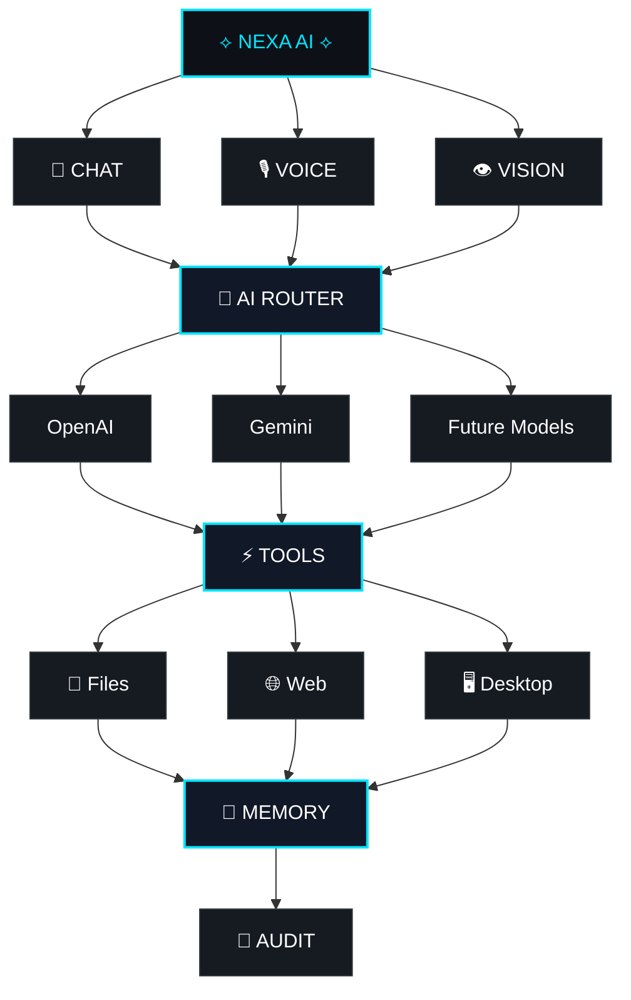

# NEXA AI
### NEXT-GENERATION DESKTOP INTELLIGENCE

<p align="center">
  
  
  
  
</p>

<p align="center">
  <a href="https://github.com/abdurrahman422/nexa_ai/issues"></a>
  <a href="https://github.com/abdurrahman422/nexa_ai"></a>
</p>

</div>

## ◈ THE IDEA

> **Nexa AI is not designed to be another chatbot. It is being engineered as an intelligent operating layer for the desktop.**

Nexa brings **AI interaction, automation, safe desktop actions, local discovery, voice, vision, multi-model routing, and a cinematic interface** into one extensible system.

## ✦ CORE EXPERIENCE

<table>
<tr>
<td width="50%" valign="top">

### 🧠 INTELLIGENCE

- AI command interpretation
- Modular assistant architecture
- Multi-model direction
- Context-aware workflows
- AI activity states

</td>
<td width="50%" valign="top">

### ⚡ ACTION

- Safe desktop commands
- App launching
- Website launching
- Controlled file discovery
- Command preview before execution

</td>
</tr>
<tr>
<td width="50%" valign="top">

### 👁 VISUAL SYSTEM

- 3D AI core / Earth environment
- Neural-network visual layer
- Particles, orbits and energy systems
- Holographic HUD
- Reactive interface motion

</td>
<td width="50%" valign="top">

### 🔐 TRUST LAYER

- Whitelist-first execution
- Confirmation gates
- Dangerous-command blocking
- Safe filesystem boundaries
- Audit / history foundation

</td>
</tr>
</table>

<br/>

## ◇ SYSTEM STATUS

| State | Area | Current direction |
|---|---|---|
| 🔵 **IMPLEMENTED** | Desktop shell | Electron + React + TypeScript |
| 🔵 **IMPLEMENTED** | Backend | FastAPI + Python |
| 🔵 **IMPLEMENTED** | Safe actions | Preview + validation + confirmation |
| 🔵 **IMPLEMENTED** | Visual engine | Three.js / React Three Fiber |
| 🟡 **IN PROGRESS** | Multi-LLM | Provider routing + adapters |
| 🟡 **IN PROGRESS** | Voice | Bangla STT/TTS + push-to-talk |
| 🟡 **IN PROGRESS** | Memory | Long-term context architecture |
| ⚪ **PLANNED** | RAG | Vector search + retrieval layer |
| ⚪ **PLANNED** | Browser control | Controlled browser workflows |
| ⚪ **PLANNED** | AI workspace | Code generation + project workflows |
| ⚪ **PLANNED** | Agents | Multi-agent orchestration |

---

## 🎬 EXPERIENCE MODEL

Nexa is designed around a simple loop:

**Input → Intelligence → Permission → Action → Feedback → Audit**

The UI leans into motion, depth, holographic overlays, reactive visuals, floating elements, and AI state transitions so the application feels like a **system**, not a static dashboard.

Target interaction languages:

**🇧🇩 বাংলা · 🔤 Banglish · 🇬🇧 English**

---

## 🧩 ARCHITECTURE



Long-term direction:

**AI assistant → intelligent automation layer → AI operating layer**

---

## 🛠️ TECHNOLOGY

| Layer | Stack |
|---|---|
| 🖥 Desktop | Electron |
| 🎨 Frontend | React + TypeScript + Vite |
| 🎞 Motion | Framer Motion + custom motion system |
| 🌐 3D | Three.js + React Three Fiber + Drei |
| 🐍 Backend | Python + FastAPI + Uvicorn + Pydantic |
| 🤖 AI | Multi-LLM architecture |
| 🎙 Voice | STT / TTS foundation |
| 🔐 Security | Whitelists + validation + confirmation + audit |
| ⚙️ Automation | REST / Webhooks / n8n roadmap |

---

## 🛡️ SAFETY BY DESIGN

Nexa is intended to **assist, not silently take over**.

| Principle | Implementation direction |
|---|---|
| 🔐 Least privilege | Only expose actions the system actually needs |
| 🧱 Whitelist-first | Explicitly allow supported actions |
| ✅ Confirmation | Sensitive actions require user confirmation |
| 🚫 Command blocking | Block dangerous execution patterns |
| 📁 Safe boundaries | Restrict filesystem discovery to approved areas |
| 📜 Auditability | Keep action/history foundations visible |
| 👀 Preview | Show what will happen before execution where appropriate |

> Sensitive automation should remain **permissioned, auditable, and explicit**.

---

## 🚀 WINDOWS INSTALLATION

### Requirements

**Minimum practical setup**

- Windows 10/11 — 64-bit
- 8 GB RAM
- 5 GB+ free storage
- Modern 64-bit CPU
- WebGL-capable graphics support
- Git
- Python
- Node.js LTS
- Internet connection for cloud AI / external services

**Recommended**

- 16 GB+ RAM
- Modern Core i5 / Ryzen 5 class CPU or better
- Dedicated GPU or strong integrated graphics
- SSD
- Stable broadband connection

> These are practical recommendations for a smooth Electron + 3D experience. Exact runtime requirements should follow the repository manifests.

### 1. Clone

```powershell
git clone https://github.com/abdurrahman422/nexa_ai.git
cd nexa_ai
```

### 2. Backend

```powershell
cd backend
python -m venv .venv
.\.venv\Scripts\python.exe -m pip install -r requirements.txt
```

Optional:

```powershell
.\.venv\Scripts\Activate.ps1
```

### 3. Environment

Create:

```text
backend/.env
```

Add the credentials for whichever providers you enable.

**Never commit `.env`, API keys, tokens, passwords, or private certificates.**

### 4. Start Backend

```powershell
python run_backend.py
```

Default local API:

```text
http://127.0.0.1:8000
```

### 5. Start Frontend

In another terminal:

```powershell
cd frontend
npm install
npm run dev
```

Use the scripts currently defined in `frontend/package.json` if they differ.

---

## 🗂️ PROJECT MAP

```text
nexa_ai/
├── backend/        🐍 FastAPI + AI services
├── frontend/       ⚛️ Electron + React UI
├── docs/           📚 Documentation
├── scripts/        🛠 Development utilities
├── shared/         🔗 Shared resources
├── tools/          ⚙️ Tooling
├── README.md       📖 Project overview
└── .gitignore      🔐 Repository safety
```

---

## 🧪 DEVELOPMENT

Backend checks:

```powershell
cd backend
python -m compileall app
python run_backend.py
```

Frontend:

```powershell
cd frontend
npm install
npm run build
npm run dev
```

Before release, verify:

- frontend build
- Python compilation
- API health
- safety boundaries
- desktop actions
- WebGL / 3D runtime
- environment configuration

---

## 🛣️ ROADMAP

### Next milestones

**🟡 Multi-LLM provider layer**  
Provider selection, routing, adapter work, and automatic fallback.

**🟡 Voice intelligence**  
Bangla STT/TTS, push-to-talk, and natural voice response.

**⚪ Browser & workflow automation**  
Controlled browser actions, n8n workflows, email and other integrations.

**⚪ Memory & retrieval**  
Long-term context, RAG, vector search, and document intelligence.

**⚪ AI development workspace**  
Project generation, coding workflows, and sandboxed execution patterns.

**⚪ Agent layer**  
Multi-agent orchestration and higher-level autonomous workflows.

---

## 🤝 CONTRIBUTING

Good contributions should preserve:

**🔐 Security · 🧩 Modularity · 🧪 Testability · ⚡ Performance · 🎨 UX · 🛠 Maintainability**

For major architectural changes, open an issue or discussion before introducing breaking changes.

---

## 🔐 SECURITY

Never commit:

```text
API keys
Access tokens
Passwords
Private certificates
Production .env files
```

If a credential is ever exposed, **rotate it immediately**.

---

## 📜 LICENSE

No license is currently documented in the repository.

Add a `LICENSE` file before distributing Nexa AI for public reuse.
